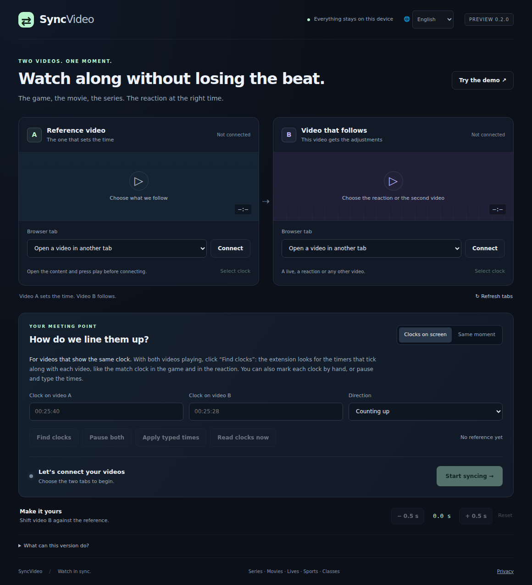

# SyncVideo ⇄

A Chrome extension that **keeps a reaction or a live in sync with the game, movie or series you are watching**, even when each of you watches through a different service.



You open the game in one tab and the creator's live in another. The creator shows the match clock on screen; your game also shows it. SyncVideo finds both clocks, reads them and moves your game (or pauses it) so both show the same minute. It keeps checking while you watch.

It doesn't matter if the creator watches on one service and you on another: what lines the videos up is **the moment in the content** (the match clock), not the position of each player. And because the clock is read from inside the creator's video, it arrives together with the reaction you hear.

## Features

- **Finds the clocks:** looks at a few frames of each video and keeps only the numbers that tick with the video. A score, a static "Replay 12:30" or a stream uptime in h:mm:ss are ignored. If there's more than one clock, you pick it with one click; you can always draw the box by hand.
- **Reads the players directly:** frames come straight from the `<video>` element, so there's no screen-sharing dialog. Players embedded from another site (iframes) work too, after you allow that site. DRM-protected players fall back to a tab capture.
- **Precise, and calm about it:** each frame carries the player position it was taken at, and several readings are averaged (the clocks only show whole seconds). A blurry frame is skipped; when the clocks change for good (halftime, a reset), it syncs again from the new ones.
- **Either side can be adjusted:** the video that is ahead goes back. If its player can't rewind (a live), it pauses for exactly the difference and resumes; if it even jumps back to live when resumed, the other video skips ahead instead.
- **One click:** "Sync now" finds the clocks and uses the frames it looked at as the first estimate, so syncing starts in seconds.
- **Keeps both videos visible:** "Put side by side" gives each video its own window and docks the panel on the right; a hidden or covered video is detected.
- **Same moment,** for videos without a clock: pause both on the same scene and mark it.
- **Fine adjustment** in half-second steps, and a **demo** with simulated clocks.
- **The creator's cam on the game:** pick the cam's area in the reaction and it appears over the game, in the corner you choose or wherever you drag it, also in fullscreen. Each video has its own volume.
- English, Português and Español; follows Chrome's language, with a menu to change it.
- **Private:** no account, no server, no analytics. Frames are read in memory on your computer and discarded. [Privacy policy](https://joaoestella.github.io/SyncVideo/).

## Install (developer mode)

1. Download or clone this repository.
2. Open `chrome://extensions` and turn on **Developer mode** (top right).
3. Click **Load unpacked** and select the **`extension`** folder.
4. Pin the icon and click it: the SyncVideo panel opens in its own window.

Chrome 116+ (and Chromium browsers such as Edge, Brave and Opera).

## How to use

1. Open the game and the reaction (or live) in Chrome and press play on both.
2. Click the SyncVideo icon. The panel opens as a narrow window on the right.
3. Choose the game as **1** and the reaction as **2**, and click **Connect** on each. Chrome asks for access to each site.
4. Click **⧉ Put side by side** so each video has its own window and both are visible.
5. Click **Sync now**. It finds both clocks and starts syncing, usually in a few seconds.

The order doesn't matter: whichever video is ahead goes back (or, if its player can't rewind, pauses for the difference). If the reaction still feels a little early or late, use the fine adjustment.

**Reaction in the background.** Chrome stops drawing videos in background tabs, so their clocks can't be read. To keep the reaction's tab in the background and the game in front, click the SyncVideo icon once on the reaction's tab (or press **Alt+Shift+S** there): SyncVideo then captures that tab in a tiny, silent stream that keeps it drawing, and goes on reading its clock while its sound keeps playing. Otherwise, keep both videos visible (**⧉ Put side by side**); SyncVideo tells you when one is hidden.

### The creator's cam over the game

Step **3** puts the creator's cam in a corner of the game, so you can watch the game full size and still see the reaction:

1. **Choose the cam**: draw a box around the creator's camera in video 2.
2. Go to the reaction's tab and click the SyncVideo icon once (or press **Alt+Shift+S**). Chrome only lets an extension capture a tab after that.
3. Click **Show on the game**. Pick a corner and a size, or drag the cam anywhere; it follows the game into fullscreen.
4. Set the **Game** and **Reaction** volumes. While the cam is shown, the reaction's sound comes through the game's tab.
5. While watching, the **⋯** button on the cam opens its menu: sync again, both volumes, the corner and the size, and removing the cam. No need to go back to the panel.

The reaction's tab can then go to the background: being captured, Chrome keeps drawing it, so syncing carries on.

For content without a clock, open **No clock on screen, or the wrong one?**: pause both on the same scene and click **Mark same moment**, or type what each clock shows.

## Limits

- The panel window must stay open.
- One timeline per sync: halftime, replays, ads or a new episode need a new reference.
- Clocks are read as `mm:ss` or `h:mm:ss`. Stoppage time shown as `45:00 +2` is not understood yet.
- Players that block reading their image need the tab capture fallback, which Chrome asks you to confirm.
- TVs and apps outside the browser are not supported.

## Development

The extension is plain JavaScript (no build step) in `extension/`:

| File | What it does |
| --- | --- |
| `panel.js` | The session: connecting tabs, finding and reading clocks, keeping both videos in sync, arranging windows |
| `media-bridge.js` | Injected in each frame of a connected tab: lists, controls and grabs frames from `<video>` |
| `browser-adapter.js` | Talks to the bridge through `chrome.scripting` |
| `core.js` | Pure logic: clock parsing, tracking, offset estimation, what to correct and how |
| `finder.js` | Locates lines of text on a frame so OCR only reads small crops |
| `pip.js` | Injected in the game's tab: draws the captured cam over the game and plays the reaction's sound at its own volume |
| `ocr.js` | Local Tesseract.js worker, frame crops, the box editor and the tab-capture fallback |
| `i18n.js`, `locales/` | Interface languages |

```sh
npm test               # unit tests (Node 20+)
npm install            # Playwright and Tesseract.js, for the tools below
npm run test:browser   # loads the extension in Chromium; needs ffmpeg with drawtext on PATH
npm run bundle:ocr     # rebuilds extension/vendor from node_modules
npm run preview        # serves the panel at http://127.0.0.1:4188 (demo only)
```

The browser tests build two videos with clocks burned in, then sync a creator live with a game embedded from another site, a live game with a 3-second rewind window, and a live player that jumps to live when resumed.

OCR: [Tesseract.js](https://github.com/naptha/tesseract.js) 7 with the `eng` model, bundled in `extension/vendor/` with their licenses. Nothing is downloaded at runtime.

See [ROADMAP.md](ROADMAP.md) for what's next.
